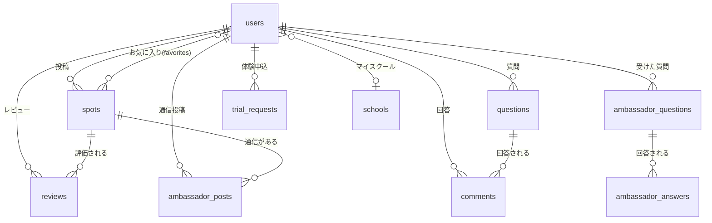

# まなとも — プロダクト仕様書
> このファイルはClaude Code・Claude.ai・事業計画策定の共通インプット。
> 機能追加・変更のたびに更新すること。

---

## 0. メタ情報
| 項目 | 内容 |
|------|------|
| アプリ名 | まなとも（MANATOMO） |
| 最終更新日 | 2026-03-15 |
| 現在のバージョン | v0.4 |
| 開発環境 | Laravel 12 / PHP 8.2 / SQLite |
| 本番環境 | （未定） |
| リポジトリ | （ローカル） |
| 開発者 | keishi |

---

## 1. サービス概要

### ミッション（1行）
習い事のブラックボックスを壊し、地域の暗黙知を街のインフラにする。

### タグライン
子どもの「好き」が見つかる場所。
親が集まり、習い事が広がる。

### 解決する課題
- 課題1: 月謝の目安が公式HPに載っていない → `monthly_fee_range` で可視化
- 課題2: 当番制度が入会後に判明する → `has_parent_duty` で事前に分かる
- 課題3: 指導方針の合う合わないが分からない → `policy_type` + `vibe_tag` で比較
- 課題4: 振替ルールが不明確 → `transfer_available` で判断
- 課題5: 教室の選択肢が狭い → 最寄り小学校からの徒歩分数で範囲を可視化

### ターゲットユーザー
| 種別 | 説明 |
|------|------|
| 保護者（user） | 小学生の子どもを持つ親。習い事を探す・口コミを投稿する |
| アンバサダー（ambassador） | 習い事教室・スポーツ少年団。スポットを掲載・通信を投稿・体験申込を受付する |
| 管理者（admin） | 運営側 |

### 展開戦略
1. 世田谷区でPMF検証
2. 近隣区（目黒・渋谷・杉並）へ横展開
3. 全国主要都市へ展開

---

## 2. 実装済み機能一覧
> ✅＝完成 / ⚠️＝部分実装 / ❌＝未着手

| # | 機能名 | 状態 | 概要 |
|---|--------|------|------|
| 1 | マップ表示 | ✅ | Google Maps JavaScript API + AdvancedMarkerElement + MarkerClusterer |
| 2 | スポット登録 | ✅ | Google Places検索 / 手動住所入力、重複検出＆マージ、写真アップロード、ステップインジケータ、リアルタイムバリデーション |
| 3 | スポット詳細モーダル | ✅ | ボトムシートUI。ヒーロー画像 + バッジ + レーダーチャート + 口コミ + アンバサダー通信 |
| 4 | カテゴリフィルター | ✅ | すべて / ⚽少年団 / 🎹個人教室 / 📚塾・学習 / 🏊施設 |
| 5 | 小学校フィルター | ✅ | 学区の小学校選択 → 1km/2km圏内のスポットをハイライト + 徒歩分数表示 |
| 6 | 教室比較機能 | ✅ | 2件選択 → レーダーチャート重ね合わせ + 詳細比較テーブル |
| 7 | 構造化レビュー | ✅ | 5軸評価（満足度/上達度/コスパ/先生の熱意/親の負担） + vibe_tag + レーダーチャート |
| 8 | 質問箱（掲示板） | ✅ | Slack風スレッドUI、カテゴリタブ、リアルタイム検索、非同期コメント投稿、「助かった」リアクション |
| 9 | アンバサダー通信 | ✅ | 教室の先生からの写真＋メッセージ投稿、mood_tag、お下がり機能 |
| 10 | アンバサダー公開Q&A | ✅ | 誰でも質問 → アンバサダーが回答 |
| 11 | 体験申込フォーム | ✅ | 公開フォーム → アンバサダーダッシュボードで管理 |
| 12 | アンバサダーダッシュボード | ✅ | 体験申込の承認/却下、投稿管理 |
| 13 | LINEログイン | ✅ | Socialite + LINE Provider。既存アカウントリンク対応 |
| 14 | マイページ | ✅ | プロフィール、統計、マイスクール設定、お気に入り管理、ご近所ボイス |
| 15 | お気に入り | ✅ | スポットのお気に入り登録/解除、マイページに一覧表示 |
| 16 | 横断検索 | ✅ | spots / questions / ambassador posts をキーワードで横断検索 |
| 17 | 徒歩分数表示 | ✅ | マイスクール or 最寄り小学校からの徒歩分数を自動計算（80m/分） |
| 18 | Push通知 | ❌ | FCM |
| 19 | 決済代行 | ❌ | 月謝アプリ内決済 |

---

## 3. 既知のバグ・未完成箇所
> 修正されるたびに消していく

| # | 箇所 | 症状 | 優先度 |
|---|------|------|--------|
| 1 | peer-checked CSS | Tailwind CDNでpeer-checked:bg-coralが動的に生成されない可能性 | 中 |

---

## 4. データ構造

### 4-1. テーブル一覧

#### users
| カラム | 型 | 説明 |
|--------|------|------|
| id | bigint PK | |
| name | string | 表示名 |
| email | string, unique | メール（LINE未提供時は `line_{id}@line.local`） |
| password | string | ハッシュ済み |
| role | string, default:'user' | `user` / `ambassador` / `admin` |
| avatar_url | string, nullable | 手動設定アバター |
| avatar | string, nullable | LINEプロフィール画像 |
| bio | string, nullable | 自己紹介 |
| organization_name | string, nullable | 教室・団体名（ambassador用） |
| my_school_id | bigint FK → schools, nullable | マイスクール |
| line_id | string, nullable, unique | LINE OAuth ID |
| timestamps | | |

#### spots
| カラム | 型 | 説明 |
|--------|------|------|
| id | bigint PK | |
| title | string | スポット名 |
| lat / lng | decimal(10,7) | 緯度・経度 |
| category | string | スポーツ少年団 / 個人教室 / 塾・学習 / 公園・遊び場 / 施設 / その他 |
| note | text, nullable | 口コミ・自由記述 |
| monthly_fee_range | string, nullable | 月謝目安（例: `5,000〜8,000円`） |
| has_parent_duty | boolean, default:false | 当番・親の出番の有無 |
| policy_type | string, nullable | `褒めて伸ばす` / `厳しく鍛える` / `バランス型` |
| transfer_available | boolean, default:false | 振替可否 |
| age_range | string, nullable | 対象年齢帯（例: `5-12`） |
| image_path | string, nullable | 画像パス（public/spots/） |
| link_url | string, nullable | 外部リンク |
| google_place_id | string, nullable | Google Places認証用ID |
| user_id | bigint | 投稿者 |
| ambassador_user_id | bigint FK → users, nullable | 管理アンバサダー |
| timestamps | | |

#### reviews
| カラム | 型 | 説明 |
|--------|------|------|
| id | bigint PK | |
| spot_id | bigint FK → spots | |
| user_id | bigint FK → users | |
| satisfaction | tinyint 1-5 | 総合満足度 |
| skill_growth | tinyint 1-5 | 上達度 |
| cost_performance | tinyint 1-5 | コスパ |
| teacher_passion | tinyint 1-5 | 先生の熱意 |
| parent_burden | tinyint 1-5 | 親の負担（★多=楽） |
| vibe_tag | string, nullable | `ガチ勢` / `エンジョイ勢` / `のびのび系` / `受験特化` |
| body | text, nullable | 口コミ自由記述 |
| timestamps | | |

#### questions
| カラム | 型 | 説明 |
|--------|------|------|
| id | bigint PK | |
| title | string | 質問タイトル |
| note | text, nullable | 質問詳細 |
| category | string, nullable | 月謝・費用 / 先生・指導 / 当番・親の負担 / 始め時・年齢 / 教室選び / 送迎・スケジュール |
| image_path | string, nullable | |
| user_id | bigint, nullable | |
| target_age | string, nullable | |
| status | string, default:'open' | `open` / `resolved` |
| spot_id | bigint FK → spots, nullable | 関連スポット |
| timestamps | | |

#### comments
| カラム | 型 | 説明 |
|--------|------|------|
| id | bigint PK | |
| question_id | bigint FK → questions | |
| user_id | bigint, nullable | |
| body | text | |
| thanks_count | integer, default:0 | 「助かった」数 |
| timestamps | | |

#### ambassador_posts
| カラム | 型 | 説明 |
|--------|------|------|
| id | bigint PK | |
| user_id | bigint FK → users | アンバサダー |
| spot_id | bigint FK → spots, nullable | 関連スポット |
| message | text | メッセージ本文 |
| photo_path | string | 写真パス |
| mood_tag | string, nullable | 気分タグ |
| has_osagari | boolean, default:false | お下がり有無 |
| osagari_item | string, nullable | お下がり品名 |
| osagari_size | string, nullable | サイズ |
| timestamps | | |

#### ambassador_questions / ambassador_answers
| テーブル | 概要 |
|----------|------|
| ambassador_questions | ユーザー → アンバサダーへの公開質問 |
| ambassador_answers | アンバサダーからの回答 |

#### trial_requests
| カラム | 型 | 説明 |
|--------|------|------|
| id | bigint PK | |
| ambassador_user_id | bigint FK → users | 対象アンバサダー |
| parent_name | string | 申込者名 |
| child_age | string | 子どもの年齢 |
| phone | string, nullable | 電話番号 |
| message | text, nullable | メッセージ |
| status | string, default:'pending' | `pending` / `approved` / `rejected` |
| timestamps | | |

#### schools
| カラム | 型 | 説明 |
|--------|------|------|
| id | bigint PK | |
| name | string | 学校名 |
| lat / lng | decimal(10,7) | 校門の位置 |
| address | string, nullable | 住所 |
| timestamps | | |

#### favorites (pivot)
| カラム | 型 | 説明 |
|--------|------|------|
| user_id | bigint FK → users | |
| spot_id | bigint FK → spots | |
| timestamps | | |

### 4-2. ER図（Mermaid）

---

## 5. 画面一覧・遷移

| # | 画面名 | URL | Bladeファイル | ログイン要否 | 概要 |
|---|--------|-----|---------------|-------------|------|
| 1 | ホーム（マップ） | `/` `/spots` | spots/index | 不要 | メインマップ + 検索 + フィルター + 詳細モーダル + 比較 |
| 2 | スポット登録 | `/spots/create` | spots/create | 不要（user_id=1fallback） | Google Places / 手動検索、ステッププログレス |
| 3 | 質問箱 | `/questions` | questions/index | 不要 | Slack風スレッドUI、カテゴリタブ |
| 4 | 質問投稿 | `/questions/create` | questions/create | 不要 | カテゴリ選択 + テキスト入力 |
| 5 | アンバサダー通信 | `/ambassador` | ambassador/index | 不要 | Instagram風タイムライン |
| 6 | アンバサダー詳細 | `/ambassador/{id}` | ambassador/show | 不要 | プロフィール + 投稿一覧 + Q&A |
| 7 | 通信投稿 | `/ambassador-post/create` | ambassador/create | 要（ambassador） | 写真 + メッセージ + mood_tag |
| 8 | 体験申込 | `/ambassador/{id}/trial` | ambassador/trial | 不要 | 公開フォーム |
| 9 | ダッシュボード | `/ambassador-dashboard` | ambassador/dashboard | 要（ambassador） | 申込管理 |
| 10 | マイページ | `/mypage` | mypage/index | 不要（ゲスト:LINE誘導 / 認証:フル表示） | プロフィール + マイスクール + お気に入り |
| 11 | 検索 | `/search` | search/index | 不要 | 横断検索 |

---

## 6. ルーティング一覧

| Method | Path | Controller@Method | 認証要否 |
|--------|------|-------------------|---------|
| GET | `/` | SpotController@index | 不要 |
| Resource | `/spots` | SpotController | 不要（投稿はuser_id fallback） |
| POST | `/spots/{spot}/reviews` | SpotController@storeReview | 不要 |
| Resource | `/questions` | QuestionController | 不要 |
| POST | `/questions/{q}/comments` | SpotController@storeComment | 不要 |
| POST | `/api/comments/{c}/thanks` | Closure | 不要 |
| GET | `/ambassador` | AmbassadorPostController@index | 不要 |
| GET | `/ambassador/{id}` | AmbassadorPostController@show | 不要 |
| POST | `/ambassador/{id}/questions` | AmbassadorPostController@storeQuestion | 不要 |
| POST | `/ambassador-questions/{q}/answers` | AmbassadorPostController@storeAnswer | 不要 |
| GET/POST | `/ambassador/{id}/trial` | AmbassadorPostController@trialForm/storeTrial | 不要 |
| GET | `/ambassador-post/create` | AmbassadorPostController@create | 要（ambassador） |
| POST | `/ambassador-post` | AmbassadorPostController@store | 要（ambassador） |
| GET | `/ambassador-dashboard` | AmbassadorPostController@dashboard | 要（ambassador） |
| PATCH | `/ambassador-trial/{t}/status` | AmbassadorPostController@updateTrialStatus | 要（ambassador） |
| GET | `/api/ambassador-pulse` | Closure（JSON） | 不要 |
| GET | `/mypage` | MyPageController@index | 不要 |
| POST | `/mypage/school` | MyPageController@updateSchool | 不要 |
| POST | `/spots/{spot}/favorite` | MyPageController@toggleFavorite | 不要 |
| GET | `/search` | SearchController@index | 不要 |
| GET | `/auth/line` | LineLoginController@redirect | 不要 |
| GET | `/auth/line/callback` | LineLoginController@callback | 不要 |
| POST | `/logout` | Closure | 不要 |
| GET | `/dev/login-as/{userId}` | Closure（デモ用） | 不要 |

---

## 7. 外部サービス・連携

| サービス | 用途 | 状態 |
|----------|------|------|
| Google Maps JavaScript API | 地図表示（AdvancedMarkerElement, MarkerClusterer） | 実装済み |
| Google Places API | スポット検索・google_place_id取得 | 実装済み |
| Google Geocoding API | 住所検索・逆ジオコーディング | 実装済み |
| LINE Login (Socialite) | ユーザー認証・アカウントリンク | 実装済み |
| Chart.js | レーダーチャート（レビュー・比較） | 実装済み |
| Tailwind CSS (CDN) | UIスタイリング | 実装済み |
| Noto Sans JP / Noto Serif JP (Google Fonts) | タイポグラフィ | 実装済み |
| FCM（Firebase） | Push通知 | 未着手 |
| Stripe / その他決済 | 月謝決済 | 未着手 |

---

## 8. デザイントークン（確定版）

### ロゴ仕様（確定）
- フォント：Nunito weight:900（Google Fonts）
- 「み」#1a1a1a 「っ」#E8704A（コーラル） 「け」#1a1a1a
- 下線：コーラル（#E8704A）の右肩上がり曲線（SVG / Q42 6）
- 装飾なし（シンプルを維持）

### ヘッダー仕様（確定）
- 背景：#CCFF66（ライムグリーン）
- 下部ボーダー：5px solid #E8704A
- ロゴ＋「＋追加」ボタン行
- キャッチコピー（「存在している。」だけコーラル）
- サブコピー
- カテゴリピル（白背景・カラー文字）

### カラーパレット（確定）
| トークン | 値 | 用途 |
|----------|----|------|
| ライムグリーン | #CCFF66 | ヘッダー背景・メインカラー |
| コーラル | #E8704A | ロゴ「っ」・下線・CTA・アクセント |
| 黒 | #1a1a1a | テキスト |
| 白 | #FFFFFF | カテゴリピル背景・地図 |
| 背景色 | #FAF7F2（ウォームクリーム） | ページ背景 |
| ボーダー | #E4DDD4 | カード・区切り線 |
| フォント（ロゴ） | Nunito W900 | |
| フォント（見出し） | Noto Serif JP W500 | |
| フォント（本文・UI） | Noto Sans JP W400/500/700 | |
| 角丸（カード） | 16px | |
| 角丸（ボタン） | 20px（pill） | |
| 角丸（入力欄） | 10px | |
| ボーダー線 | 0.5px solid #E4DDD4 | |

### カテゴリ別カラー＋アイコン定義（全体で統一）
| カテゴリ | 絵文字 | 背景色 | 文字色 |
|---|---|---|---|
| スポーツ少年団 | ⚽ | #FFF0E0 | #E8704A |
| 個人教室（音楽） | 🎵 | #EEF0FF | #5B5BD6 |
| 塾・学習 | 📖 | #FFF8E0 | #C9973A |
| 水泳・体操 | 🏊 | #E0F4FF | #3A9CC9 |
| バレエ・ダンス | 🩰 | #FFE0F4 | #C93A8A |
| 武道・空手 | 🥋 | #F0F0F0 | #444444 |
| 英語・語学 | 🌍 | #E0FFE8 | #3AC95B |
| 公園・遊び場 | 🌳 | #E8FFE0 | #5BC93A |
| その他 | ✨ | #F5F0FF | #7B5BD6 |

### 禁止事項
- box-shadow でカードに影をつけない
- 背景を純白 #FFFFFF・グレー #F5F5F5 にしない（地図・ピル背景は除く）
- ボーダーを #CCCCCC 等の汎用グレーにしない → #E4DDD4
- レインボー・多色使いのUI

---

## 9. 技術スタック

| レイヤー | 技術 |
|----------|------|
| Backend | Laravel 12 / PHP 8.2+ |
| Frontend | Blade + Tailwind CSS (CDN) + Google Fonts |
| DB（開発） | SQLite |
| DB（本番想定） | PostgreSQL + PostGIS |
| 地図 | Google Maps JavaScript API (AdvancedMarkerElement) |
| 認証 | LINE Login (laravel/socialite + socialiteproviders/line) |
| Cache/Queue/Session | database ドライバ |
| チャート | Chart.js |

---

## 10. マネタイズ計画

| フェーズ | 内容 | 時期 |
|----------|------|------|
| Phase 1 | PLG（習い事スコア・バッジ・SNSシェアで口コミ集客） | 現在 |
| Phase 2 | 教室向け広告枠 / プレミアム掲載（月額サブスク） | PMF後 |
| Phase 3 | 月謝決済代行（手数料3〜5%） | 全国展開後 |
| Phase 4 | 匿名化地域データ販売（不動産・自治体向け） | スケール後 |

---

## 11. 今後のロードマップ

| 優先度 | 機能 | 概要 | 担当 |
|--------|------|------|------|
| ~~🔴 高~~ | ~~認証必須化~~ | ~~user_idハードコード解消~~ → **完了** (2026-03-15) | |
| 🔴 高 | お下がりマッチング強化 | 通知・ステータス管理の充実 | |
| 🟡 中 | セーフティログ | 通学路の危険箇所マッピング | |
| 🟡 中 | Push通知 | FCMによる回答通知・新着通信通知 | |
| 🟡 中 | マイスクール未設定時のオンボーディング | 初回アクセス時に学校選択を促す | |
| 🟢 低 | 決済代行 | Stripe連携 | |
| 🟢 低 | マルチエリア展開 | area_code による他区対応 | |
| 🟢 低 | ダークモード | 将来対応 | |

---

## 12. 競合・差別化

| サービス | 概要 | まなともとの違い |
|----------|------|----------------|
| スタディサプリ for School | 学習系 | 習い事全般・地域コミュニティがない |
| Conobie / 子育て情報サイト | 記事メディア | UGCの口コミ・地図機能がない |
| きっずとっぷ遊び体験 | 体験予約 | 継続的な習い事・親同士の交流がない |
| 地域のFacebookグループ | 非公式口コミ | 検索・比較・構造化データがない |

---

## 更新履歴
| 日付 | 更新内容 |
|------|---------|
| 2026-03-15 | 認証修正: user_idハードコード解消、authミドルウェア適用、未ログイン導線LINE統一、マイページ完成（自分の投稿・ambassadorセクション追加） |
| 2026-03-15 | テンプレートに沿って全面改訂。実装済み機能・データ構造・ルーティングを現状に合わせて更新。ブランドトークン確定版を反映 |
| 2026-03-15 | ブランドを「まなとも」に変更、デザイントークン確定 |
| 2026-03-14 | LINE連携実装、徒歩分数ロジック追加 |
| 2026-03-12 | マイページ・お気に入り・マイスクール・アンバサダーQ&A・体験申込実装 |
| 2026-03-10 | アンバサダー通信機能実装、ロール制導入 |
| 2026-03-09 | 習い事メタデータ（月謝・当番・方針・振替）追加、Google Places連携 |
| 2026-03-07 | 初版作成（Kids Compass時代） |
