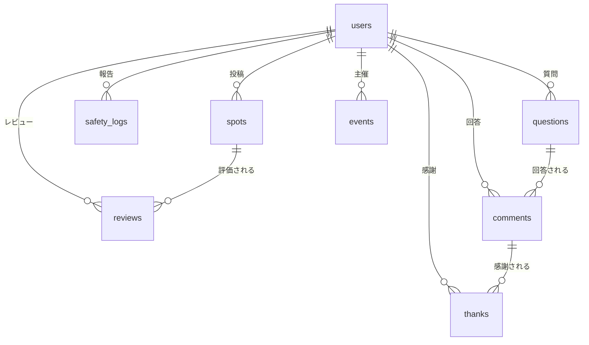

# SETAGAYA KIDS COMPASS — プロダクト仕様書

> 最終更新: 2026-03-09

---

## 1. サービス概要

### ミッション
**習い事のブラックボックスを壊す。地域の暗黙知を街のインフラにする。**

公式HPに載らない「当番制度」「指導方針」「リアルな月謝」「振替ルール」——
親が本当に知りたいのに、どこにも書いていない情報を地図上に集約する **ローカル子育てOS**。

### コアバリュー
習い事の "ブラックボックス化" の解消。
- 月謝の目安が分からない → `monthly_fee_range` で可視化
- 当番制度が入ってから判明 → `has_parent_duty` で事前に分かる
- 厳しさが合わない → `policy_type`（褒めて伸ばす / 厳しく鍛える）で比較
- 急な予定変更に対応できるか → `transfer_available`（振替可否）で判断

### ターゲットユーザー
世田谷区在住のタイパ重視な共働き子育て世帯（メイン: 30〜40代）。

### 技術スタック
| レイヤー | 技術 |
|---------|------|
| Backend | Laravel 12 (PHP 8.2+) |
| Frontend | Blade + Tailwind CSS (CDN) + Vite |
| DB | SQLite（開発） / PostgreSQL + PostGIS（本番想定） |
| 地図 | Leaflet.js + OpenStreetMap (Carto Voyager タイル) |
| 住所検索 | Nominatim (OpenStreetMap) |
| Cache/Queue/Session | database ドライバ |

---

## 2. 主要機能

### 2-1. インテリジェンス・ローカルマップ (`spots`)

地図上にスポット（習い事教室・公園・施設）をピン表示し、親のリアルな声を集約する中核機能。

#### マップUI
- Leaflet.js による全画面マップ。写真ピン + スポット名ラベル
- カテゴリフィルター（すべて / スポーツ少年団 / 個人教室 / 塾・学習 / 公園・遊び場 / 施設）
- リアルタイム検索 → オートコンプリート → 選択でマップがflyTo + 詳細モーダル自動展開
- タップでInstagram風フルスクリーンモーダル（ヒーロー画像 + 重要バッジ + 口コミ + タグ）

#### 習い事カードバッジ（一目で分かる重要情報）
マップ上のピンおよび詳細モーダルに以下のバッジを表示:
- 💰 **月謝目安** — `monthly_fee_range`（例: `5,000〜8,000円`）
- 📋 **当番なし** or **当番あり** — `has_parent_duty`
- 🌱 **褒めて伸ばす** or 🔥 **厳しく鍛える** — `policy_type`
- 🔄 **振替可** or **振替不可** — `transfer_available`
- 🎒 **対象年齢** — `age_range`

#### スポット登録 (`spots/create`)
- Nominatim 住所検索 → 候補選択 → マーカー自動配置
- ドラッグ / タップで位置微調整、逆ジオコーディングで住所自動表示
- カテゴリ選択（スポーツ少年団 / 個人教室 / 塾・学習 / 公園・遊び場 / 施設 / その他）
- 習い事メタデータ入力（月謝目安 / 当番有無 / 指導方針 / 振替可否）
- 写真アップロード（プレビュー付き）

### 2-2. 構造化レビュー (`reviews`)

スポットに紐づく、**親の一次情報に特化**した定量レビュー。

| 評価軸 | 型 | 説明 |
|--------|------|------|
| `satisfaction` | 1-5 | 総合満足度 |
| `skill_growth` | 1-5 | 上達度・成長実感 |
| `parent_burden` | 1-5 | 親の負担度（1:楽〜5:大変） |
| `monthly_fee` | integer | 実際の月謝（円） |
| `parent_duty` | boolean | 当番の有無 |
| `strictness` | 1-5 | 指導の厳しさ |
| `vibe_tag` | string | 雰囲気タグ（`ガチ勢` / `エンジョイ勢` / `のびのび系` / `受験特化`） |
| `body` | text | 口コミ自由記述 |

**設計意図**: `strictness` は「ガチ勢向き or エンジョイ勢向き」を判断する最重要指標。`vibe_tag` でさらに雰囲気を直感的に伝える。

### 2-3. 「教えてタグ」掲示板 (`questions`)

「公園のベンチでの立ち話」をコンセプトにした、温かみのあるQ&A機能。

- ステータスフィルター（すべて / 受付中 / 解決済み）
- 質問は吹き出し（Bubble）デザイン、回答はチャット風タイムライン
- 各回答に「助かった！」ボタン → `thanks_count` 加算 + 質問カードのサマリーに連動表示
- アイコン付きカテゴリ選択、匿名投稿トグル（デフォルトON）

### 2-4. 協創型キュレーション — イベント投稿 (`events`)

ネットに載らない地域行事を配信。事業者・公式アカウント向け。

- イベント一覧（日付カード + 主催者バッジ + 対象年齢）
- 詳細画面（日時・場所の情報カード、外部リンク）
- `is_official` フラグを持つユーザーの投稿は「公式」バッジ付きで優先表示

### 2-5. 横断検索 (`search`)

- spots / questions / events をキーワードで横断検索
- 結果はモデル別にグループ表示

---

## 3. データ構造

### 3-1. spots テーブル
| カラム | 型 | 説明 |
|--------|------|------|
| id | bigint PK | |
| title | string | スポット名（省略不可・全文記載） |
| lat | decimal(10,7) | 緯度 |
| lng | decimal(10,7) | 経度 |
| category | string, nullable | スポーツ少年団 / 個人教室 / 塾・学習 / 公園・遊び場 / 施設 / その他 |
| note | text, nullable | 口コミ・自由記述 |
| user_id | bigint | 投稿者 |
| image_path | string, nullable | 画像パス |
| link_url | string, nullable | 外部リンク |
| age_range | string, nullable | 対象年齢帯（例: `"3-12"`） |
| monthly_fee_range | string, nullable | 月謝目安（例: `"5,000〜8,000円"`） |
| has_parent_duty | boolean, default:false | 当番・親の出番の有無 |
| policy_type | string, nullable | 指導方針: `褒めて伸ばす` / `厳しく鍛える` / `バランス型` |
| transfer_available | boolean, default:false | 振替可否 |
| category_tags | json, nullable | タグ配列 |
| timestamps | | |

### 3-2. reviews テーブル
| カラム | 型 | 説明 |
|--------|------|------|
| id | bigint PK | |
| spot_id | bigint FK → spots | 対象スポット |
| user_id | bigint FK → users | レビュー投稿者 |
| satisfaction | tinyint, nullable | 総合満足度 1-5 |
| skill_growth | tinyint, nullable | 上達度 1-5 |
| parent_burden | tinyint, nullable | 親の負担度 1-5 |
| monthly_fee | integer, nullable | 実際の月謝（円） |
| parent_duty | boolean, default:false | 当番有無 |
| strictness | tinyint, nullable | 指導の厳しさ 1-5 |
| vibe_tag | string, nullable | ガチ勢 / エンジョイ勢 / のびのび系 / 受験特化 |
| body | text, nullable | 口コミ自由記述 |
| timestamps | | |

### 3-3. questions テーブル
| カラム | 型 | 説明 |
|--------|------|------|
| id | bigint PK | |
| title | string | 質問タイトル |
| note | text, nullable | 質問詳細 |
| category | string, nullable | カテゴリ |
| image_path | string, nullable | 画像パス |
| lat | decimal(10,7), nullable | 質問地点の緯度 |
| lng | decimal(10,7), nullable | 質問地点の経度 |
| user_id | bigint, nullable | 質問者 |
| target_age | string, nullable | 対象年齢 |
| status | string, default:`'open'` | `open` / `resolved` |
| timestamps | | |

### 3-4. comments テーブル
| カラム | 型 | 説明 |
|--------|------|------|
| id | bigint PK | |
| question_id | bigint FK → questions | 質問 |
| user_id | bigint, nullable | 回答者 |
| body | text | 回答本文 |
| thanks_count | integer, default:0 | 「助かった」数 |
| timestamps | | |

### 3-5. events テーブル
| カラム | 型 | 説明 |
|--------|------|------|
| id | bigint PK | |
| title | string | イベント名 |
| description | text, nullable | 説明 |
| event_date | datetime | 開催日時 |
| organizer_name | string, nullable | 主催者名 |
| location_name | string, nullable | 場所名 |
| lat | decimal(10,7), nullable | 緯度 |
| lng | decimal(10,7), nullable | 経度 |
| image_path | string, nullable | 画像パス |
| link_url | string, nullable | 外部リンク |
| user_id | bigint, nullable | 投稿者 |
| category_tags | json, nullable | カテゴリタグ |
| target_age | string, nullable | 対象年齢帯 |
| timestamps | | |

### 3-6. users テーブル
| カラム | 型 | 説明 |
|--------|------|------|
| id | bigint PK | |
| name | string | 表示名 |
| email | string, unique | |
| password | string | |
| nickname | string, nullable | 匿名表示用ニックネーム |
| thanks_score | integer, default:0 | 感謝スコア累計 |
| badge_level | string, default:`'newcomer'` | |
| is_official | boolean, default:false | 公式アカウント |
| area_code | string, nullable | 地域コード |
| timestamps | | |

### 3-7. thanks テーブル
| カラム | 型 | 説明 |
|--------|------|------|
| id | bigint PK | |
| user_id | bigint FK → users | |
| comment_id | bigint FK → comments | |
| timestamps | | |
| UNIQUE(user_id, comment_id) | | 重複投票防止 |

### 3-8. safety_logs テーブル
| カラム | 型 | 説明 |
|--------|------|------|
| id | bigint PK | |
| lat | decimal(10,7) | 緯度 |
| lng | decimal(10,7) | 経度 |
| danger_type | string | 交通量 / 死角 / 不審者 / その他 |
| time_zone | string, nullable | 朝 / 昼 / 夕方 / 夜 |
| note | text, nullable | |
| user_id | bigint FK → users | |
| reaction_count | integer, default:0 | |
| timestamps | | |

### ER図

---

## 4. ルーティング

| Method | Path | Controller@Method | 説明 |
|--------|------|-------------------|------|
| GET | `/` | SpotController@index | ホーム（マップ） |
| GET/POST/... | `/spots` (Resource) | SpotController | スポットCRUD |
| GET/POST/... | `/questions` (Resource) | QuestionController | 質問CRUD |
| POST | `/questions/{question}/comments` | SpotController@storeComment | コメント投稿 |
| GET | `/events` | EventController@index | イベント一覧 |
| GET | `/events/{id}` | EventController@show | イベント詳細 |
| GET | `/search` | SearchController@index | 横断検索 |

---

## 5. UI/UXルール

### デザイン原則
- **Instagram風カードデザイン**: 写真が浮き出る Shadow + Rounded (rounded-2xl〜3xl)
- **場所名は省略禁止**: 全文記載。`substring` や `text-overflow: ellipsis` は使わない
- **習い事バッジ**: カード上に「当番なし」「振替可」「月謝 5,000〜8,000円」などのバッジを一目で分かるように表示
- **片手操作前提**: 大きめタッチターゲット、下部タブバー + 中央FAB

### トンマナ
- 白ベース + emeraldグリーン（`brand-500: #22c55e`）のアクセント
- rounded-2xl / rounded-3xl の柔らかい角丸
- 控えめシャドウ（`shadow-sm` / `shadow-[0_2px_16px_...]`）

---

## 6. マネタイズ戦略

### Phase 1: PLG（Product-Led Growth）
- 感謝アニメーション・バッジ獲得演出でエンゲージメント
- SNSシェア動線（LINE・X）で口コミ集客

### Phase 2: 収益化
- **超特化型広告**（塾・教室向け）: スポット詳細やカテゴリ検索に地域教室の広告枠
- **プレミアム掲載機能**: 公式アカウントによるリッチスポット掲載（月額サブスク）
- **エリアマーケティングデータ**: 匿名化・集約化された地域データの提供（不動産・自治体向け）

### Phase 3: 決済代行機能
- 習い事の月謝をアプリ内で支払える決済代行（手数料3〜5%）

### 展開戦略
1. **世田谷区**でPMF達成
2. 近隣区（目黒・渋谷・杉並）へ横展開
3. 全国主要都市へ展開（`area_code` によるマルチテナント設計）

---

## 7. 今後の拡張予定

| 優先度 | 機能 | 概要 |
|--------|------|------|
| 🔴 高 | ユーザー認証 | Laravel Breeze or LINE Login |
| 🔴 高 | Thanks API | 「助かった」のDB永続化 + スコア加算 |
| 🟡 中 | SafetyLog UI | セーフティログ投稿・マップ表示 |
| 🟡 中 | イベント投稿フォーム | 事業者向けイベント作成画面 |
| 🟢 低 | Push通知 | FCM による回答依頼通知 |
| 🟢 低 | 決済代行 | 月謝のアプリ内決済 |
| 🟢 低 | マルチエリア展開 | area_code による他区対応 |
